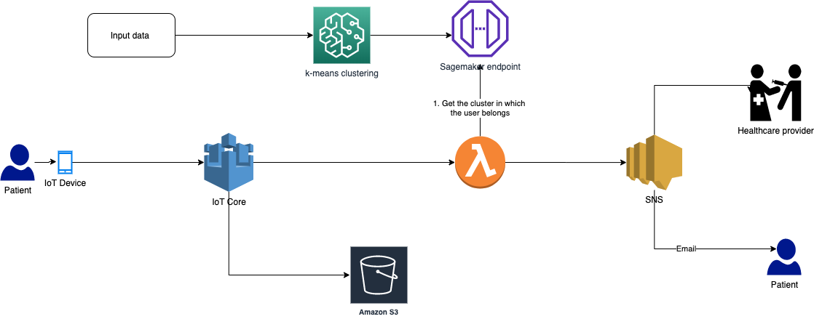

# Novel Diabetic cluster identification using sagemaker

Diabetes classification based on the paper [Novel subgroups of adult-onset diabetes and their association with outcomes: a data-driven cluster analysis of six variables](
https://www.thelancet.com/journals/landia/article/PIIS2213-8587(18)30051-2/fulltext). We use sagemaker to cluster the data based on the following variables:

1. glutamate decarboxylase antibodies (GAD), 
2. age at diagnosis, 
3. BMI
4. HbA1c
5. [homoeostatic model assessment](https://en.wikipedia.org/wiki/Homeostatic_model_assessment) estimates of insulin resistance
6. [homoeostatic model assessment](https://en.wikipedia.org/wiki/Homeostatic_model_assessment) estimates of β-cell function

This will allow us to place the patients in 5 finely defined clusters as opposed to generic 2 clusters (Type 1 and Type 2). This will allow healthcare providers to provide more targetted care to patients.

# Architecture diagram

# Instructions

1. Data generation - You can generate dummy data using data_generator.py . This file generates 10,000 records. You can use this to build a model for testing. Once the file is generated place it in a bucket in s3
2. main.ipynb , preprocessing.py - Copy these 2 files in your sagmeaker notebook. This will help you preprocess the data, train the model and deploy the model.
3. inference.py or inference.js - You can use either of these to run inference on generated model
